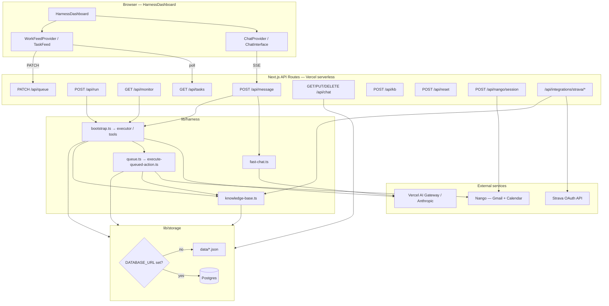
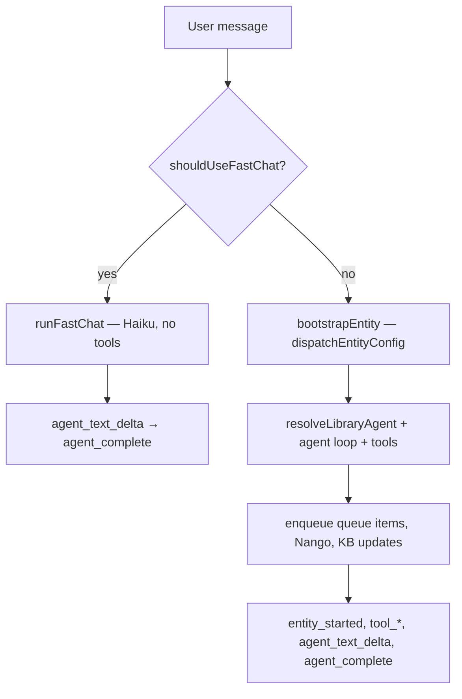
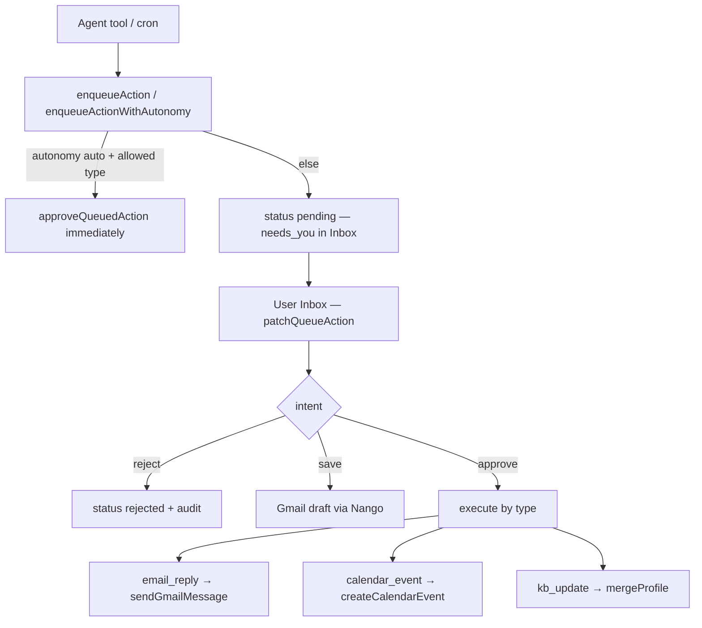

# aidea — infrastructure & data architecture

How the platform is deployed, where data lives, how integrations and the agent harness connect. **P7 is complete on prod; P8 hardens partials and adds live connectors (Strava, contact graph, finance spike). P8.4 auth/multi-user is still open.**

**Related:** [Product vision](/docs/vision) · [Gap closure plan](/docs/plan) · [Deployment](/docs/deployment) · [Agent instructions](/docs/agents)

> **Interactive reader:** Open [/docs/architecture](/docs/architecture) in the app to view Mermaid diagrams and use light reading mode (sidebar nav + table of contents).

---

## High-level system diagram

**Tenant model:** All storage calls use `getUserId()` → `process.env.DEFAULT_USER_ID ?? 'default'`. There is **no session auth** today; Nango connections are tagged with the same `end_user_id`.

---

## Runtime & deployment

| Mode | URL | Storage | LLM | Integrations |
|------|-----|---------|-----|--------------|
| **Local dev (default)** | `http://localhost:3000` | Filesystem `data/` when `DATABASE_URL` unset | `AI_GATEWAY_API_KEY` or `ANTHROPIC_API_KEY` | Nango + Strava via `.env.local` |
| **Local Postgres parity** | localhost | Postgres when `DATABASE_URL` set | same | same |
| **Production** | [aidea-co.vercel.app](https://aidea-co.vercel.app) | Postgres (required) | `AI_GATEWAY_API_KEY` on Vercel | Nango + Strava env vars |

**Vercel model:**

- Next.js App Router, `runtime = 'nodejs'`, long routes (`/api/message`, `/api/run`, `/api/monitor`) use `maxDuration = 1800`.
- Postgres client: `max: 1` connection per instance (serverless-safe).
- Schema auto-applied on first DB access via `lib/db/migrate.ts`.
- **Settings panel writes are blocked on Vercel** (`isProductionDeploy()`); API keys must be Vercel env vars, not in-app form saves.
- **Crons:** `GET /api/monitor?name=daily|inbox|calendar|relationships` — authorized via `Authorization: Bearer CRON_SECRET` (open in non-prod if secret unset).
- **Human-in-the-loop across instances:** optional Vercel KV (`KV_REST_*`) for `request_human_input`; otherwise in-memory Map (single dev server only).

**Activity reset** (`POST /api/reset`, Settings danger zone, `npm run reset:activity`) clears queue, audit, harness runs, chat, latest brief — **preserves** profile/KB, app settings, Nango/Strava connections.

See [DEPLOYMENT.md](./DEPLOYMENT.md) for env vars, Nango setup, and prod smoke checklist.

---

## Data layer

Central facade: `lib/storage/index.ts` — switches filesystem vs Postgres transparently.

### Where things live

| Domain | Filesystem (`data/`) | Postgres table | Notes |
|--------|----------------------|----------------|-------|
| **Profile / KB** | `knowledge-base.json` | `profiles.data` (JSONB) | Same document; KB helpers in `lib/harness/knowledge-base.ts` with 15s in-process cache (60s in dev) |
| **Queue** | `action-queue.json` | `action_queue` | Pending approvals + resolved items |
| **Audit** | `action-audit.json` | `action_audit` | Approve/reject/save/fail events; `GET /api/queue/audit` |
| **Harness runs** | `harness-state.json` | `harness_entities` | Entity/agent run state for Studio + feed |
| **Chat** | `chat/conversations/*.json` + `chat/meta.json` | `chat_conversations`, `chat_meta` (+ legacy `chat_store`) | Client also caches in `localStorage` key `aidea-chat-v1` |
| **Daily brief** | `latest-brief.json` | `latest_briefs` | Written by cron lite daily monitor |
| **App settings** | `settings.json` | `app_settings` | Local-only writes; prod uses env vars |
| **Strava tokens** | Inside profile at `integrations.strava` | Same in `profiles.data` | Not Nango — direct OAuth |
| **Nango connections** | External (Nango cloud) | — | Listed by `end_user_id`; not in local JSON |

### Merge semantics

- **`mergeProfile(updates)`** — top-level keys replace; dot-keys (e.g. `health.sync`) use nested merge via `lib/storage/nested-keys.ts`.
- **`writeManyKB` / `writeKB`** — batch or single-key writes through profile; invalidate KB cache on write.
- **Queue items** — upserted by id in `saveQueuedAction`; bulk clear via `replaceQueue`.
- **Chat** — per-conversation JSON files or rows; active conversation id in meta.

### Unified Work feed (`GET /api/tasks`)

Builds from: queue actions + harness entity states + KB proactive suggestions + latest brief + audit timeline + per-domain autonomy settings. Summary mode (`?summary=1`) returns badge counts only (`needsYou`, `suggestions`).

---

## Integration layer

### LLM (`lib/ai/provider.ts`)

Priority: **`AI_GATEWAY_API_KEY`** → **`ANTHROPIC_API_KEY`** → Vercel OIDC gateway. Production expects gateway key; OIDC-only often returns 403 on multi-agent runs.

Models route through Vercel AI Gateway (`anthropic/claude-*`). Fast chat uses Haiku; Studio CEOs use Sonnet.

### Nango — Gmail & Calendar

- Env: `NANGO_SECRET_KEY`; optional `NANGO_GMAIL_INTEGRATION_ID` / `NANGO_CALENDAR_INTEGRATION_ID` (defaults: `google-mail`, `google-calendar`).
- Connect flow: Settings → `POST /api/nango/session` → Nango Connect UI → connections stored in Nango tagged with `DEFAULT_USER_ID`.
- Runtime: `lib/nango/gmail.ts`, `lib/nango/calendar.ts` — read inbox, send mail, create drafts, create calendar events.
- Harness auto-upgrades `realWorldToolMode` from `dry-run` to `auto` when Nango connections exist.

### Strava — health (P8.1, not Nango)

- Direct OAuth: `GET /api/integrations/strava/authorize` → callback → tokens merged into profile `integrations.strava`.
- Sync: `syncStravaToKb()` → KB `health.sync`; `health_read` tool reads live data.
- Env: `STRAVA_CLIENT_ID`, `STRAVA_CLIENT_SECRET`, optional `STRAVA_REDIRECT_URI`.

### Other

- **Brave Search:** `BRAVE_SEARCH_API_KEY` for web search tool.
- **Integration status:** `GET /api/integrations` aggregates LLM, Google (Nango), Strava, Brave.

---

## Agent / harness execution flow

### Two chat paths (`POST /api/message`)

Client: `useChatConversations` → `fetch('/api/message')` → **`consumeHarnessSSE`** (`lib/client/sse.ts`). Server: **`harnessSSEResponse`** (`lib/api/sse.ts`).

### Studio / crons

| Entry | Config | Purpose |
|-------|--------|---------|
| `POST /api/run` | company/personal/learning/creator/daily entity configs | Studio debug runs |
| `GET /api/monitor?name=…` | daily lite, inbox-triage, calendar-reader, relationship-monitor | Scheduled workforce |

Bootstrap pipeline (`lib/harness/bootstrap.ts`): create entity state → load Nango status + agent overrides → spawn root agent → `runAgentLoop` (or daily kickstart for orchestrator) → persist entity state → tools may **`enqueueAction`** / **`enqueueActionWithAutonomy`**.

### Queue: propose → approve → execute

Per-domain autonomy (`domain-autonomy.ts`) gates auto-execute vs `needs_you` on enqueue and PATCH.

---

## Client architecture

**`HarnessDashboard`** (`components/harness/HarnessDashboard.tsx`):

- Onboarding gate → **`ChatProvider`** + **`WorkFeedProvider`**
- Views: **Home** (chat + Inbox), Agents, Studio, Context, Settings
- **`WorkFeedProvider`** — single poller for Inbox + nav badge:
  - Home idle ~20s, active (agents/chat streaming) ~6s, off-Home summary ~45s; paused when tab hidden
  - `refresh()` after chat complete, queue PATCH, activity reset
- **`useHarnessSession`** — Studio runs via `/api/run` SSE
- **`HumanInputOverlay`** — answers `request_human_input` (local Map or Vercel KV)

**Home layout:** desktop — chat left, Inbox ~380px right; mobile — full chat + Inbox overlay.

---

## API route map (22 routes)

| Route | Role |
|-------|------|
| `/api/message` | Home chat dispatch (fast + full SSE) |
| `/api/run` | Studio entity runs (SSE) |
| `/api/monitor` | Vercel cron monitors |
| `/api/tasks`, `/api/tasks/suggestions` | Unified Inbox feed + suggestion actions |
| `/api/queue`, `/api/queue/audit` | Queue CRUD + audit history |
| `/api/chat` | Conversation persistence |
| `/api/kb` | KB batch writes |
| `/api/brief` | Latest brief read |
| `/api/agents` | Agent library + overrides |
| `/api/settings` | Settings read (write local only) |
| `/api/reset` | Activity history reset |
| `/api/onboarding` | Onboarding completion flag |
| `/api/nango/session`, `/api/nango/connections` | Google OAuth connect/disconnect |
| `/api/integrations`, `/api/integrations/strava/*` | Status + Strava OAuth |
| `/api/entity/[entityId]` | Entity state |
| `/api/respond` | Human-input answers |

---

## Key environment variables

| Variable | Purpose |
|----------|---------|
| `DATABASE_URL` | Postgres (also `POSTGRES_URL`, `POSTGRES_PRISMA_URL`) |
| `DEFAULT_USER_ID` | Single-tenant user id (default `default`) |
| `AI_GATEWAY_API_KEY` | Vercel AI Gateway (prod LLM auth) |
| `AI_GATEWAY_BASE_URL` | Optional gateway URL override |
| `ANTHROPIC_API_KEY` | Direct Anthropic fallback (local dev) |
| `NANGO_SECRET_KEY` | Nango OAuth (Gmail + Calendar) |
| `NANGO_GMAIL_INTEGRATION_ID` | Nango Gmail integration key |
| `NANGO_CALENDAR_INTEGRATION_ID` | Nango Calendar integration key |
| `BRAVE_SEARCH_API_KEY` | Web search tool |
| `STRAVA_CLIENT_ID` | Strava OAuth |
| `STRAVA_CLIENT_SECRET` | Strava OAuth |
| `STRAVA_REDIRECT_URI` | Strava callback override |
| `CRON_SECRET` | Authorize `/api/monitor` cron calls |
| `KV_REST_API_URL` | Vercel KV — human input across instances |
| `KV_REST_API_TOKEN` | Vercel KV write |
| `KV_REST_API_READ_ONLY_TOKEN` | Vercel KV read |
| `VERCEL` | Set on Vercel deploy (blocks settings writes) |
| `VERCEL_OIDC_TOKEN` | Fallback gateway auth on Vercel |
| `NODE_ENV` | Dev vs prod behavior (caches, cron auth fallback) |

Full deployment checklist: [DEPLOYMENT.md](./DEPLOYMENT.md).

---

## Current gaps (P8.4)

- **No auth middleware** — anyone with the URL shares one tenant (`DEFAULT_USER_ID`).
- **Multi-user** requires session → per-user `DEFAULT_USER_ID` on all storage/Nango tags.
- **Mobile polish** on Agents/Context/Settings secondary surfaces still open.

Everything else in the daily loop (Home chat, Inbox approvals, crons, timeline, per-domain autonomy, Strava sync, contact graph, finance spike) is shipped per P7 + P8 checkboxes in [PLAN.md](./PLAN.md).
