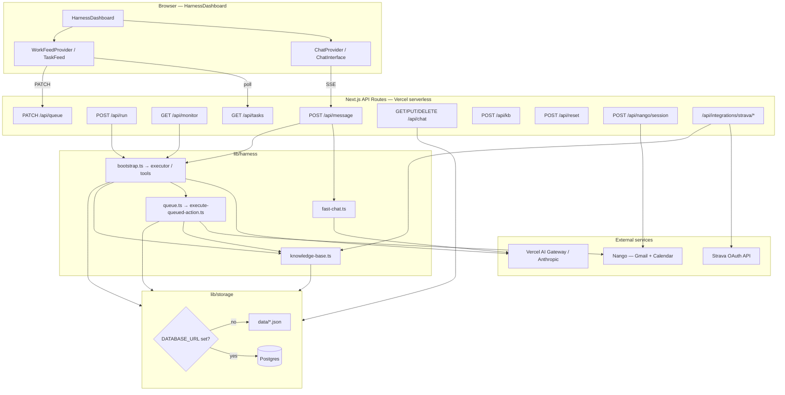
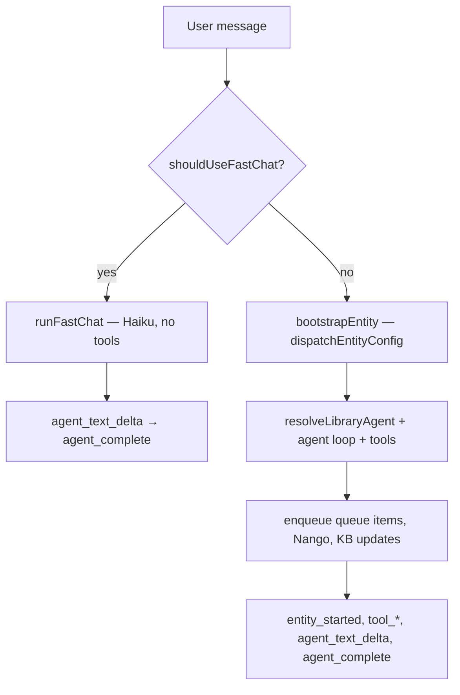
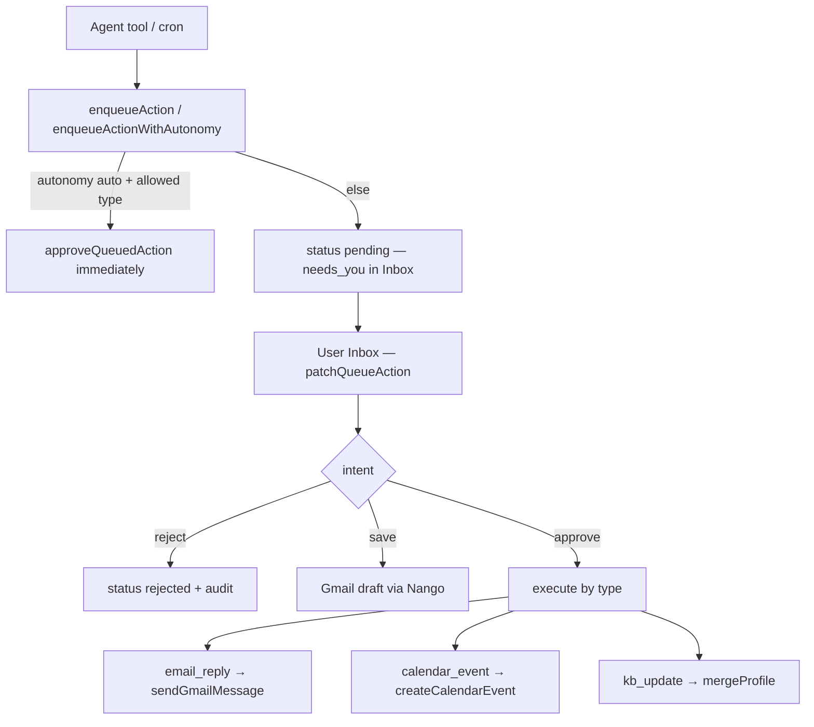

# aidea — infrastructure & data architecture

How the platform is deployed, where data lives, how integrations and the agent harness connect. **P7 is complete on prod; P8 hardens partials and adds live connectors (Strava, contact graph, finance spike). P8.4 auth/multi-user hardening is complete; mobile secondary-surface polish remains.**

**Related:** [Product vision](/docs/vision) · [Gap closure plan](/docs/plan) · [Deployment](/docs/deployment) · [Agent instructions](/docs/agents)

> **Interactive reader:** Open [/docs/architecture](/docs/architecture) in the app to view Mermaid diagrams and use light reading mode (sidebar nav + table of contents).

---

## High-level system diagram

**Tenant model:** In Postgres mode, user data is scoped by an HMAC-signed app session. Demo sessions use isolated random `demo:*` ids. Google entry uses Nango OAuth to verify the account, derives a stable opaque `google:*` tenant from the normalized Google email, and preserves the temporary Nango owner id for connection lookups. Production API middleware rejects missing, expired, or tampered sessions. `DEFAULT_USER_ID ?? 'default'` remains only as the local/CLI/cron fallback. Filesystem storage remains a single-user local development fallback.

---

## Runtime & deployment

| Mode | URL | Storage | LLM | Integrations |
|------|-----|---------|-----|--------------|
| **Local dev (default)** | `http://localhost:3000` | Filesystem `data/` when `DATABASE_URL` unset | `AI_GATEWAY_API_KEY` or `ANTHROPIC_API_KEY` | Nango + Strava via `.env.local` |
| **Local Postgres parity** | localhost | Postgres when `DATABASE_URL` set | same | same |
| **Production** | [aidea-co.vercel.app](https://aidea-co.vercel.app) | Postgres (required) | `AI_GATEWAY_API_KEY` on Vercel | Nango + Strava env vars |

**Vercel model:**

- Next.js App Router, `runtime = 'nodejs'`, long routes (`/api/message`, `/api/run`, `/api/monitor`) use `maxDuration = 1800`.
- Postgres client: `max: 1` connection per instance (serverless-safe).
- Schema auto-applied on first DB access via `lib/db/migrate.ts`.
- **Settings panel writes are blocked on Vercel** (`isProductionDeploy()`); API keys must be Vercel env vars, not in-app form saves.
- **Crons:** `GET /api/monitor?name=…` — scheduled jobs in [`vercel.json`](../vercel.json) (`daily`, `inbox`, `relationships`); `calendar` is supported in code but not scheduled. Authorized via `Authorization: Bearer CRON_SECRET` (open in non-prod if secret unset).
- **Human-in-the-loop across instances:** optional Vercel KV (`KV_REST_*`) for `request_human_input`; otherwise in-memory Map (single dev server only).

### Vercel platform services

What aidea uses on Vercel vs what it does not. Postgres (Neon, Supabase, etc.) is **external** — not Vercel Postgres unless you choose that provider for `DATABASE_URL`.

| Service | Used? | Role |
|---------|-------|------|
| **Hosting** (Next.js serverless) | Yes | Prod at [aidea-co.vercel.app](https://aidea-co.vercel.app); App Router, `runtime = 'nodejs'`, `maxDuration = 1800` on `/api/message`, `/api/run`, `/api/monitor` ([`vercel.json`](../vercel.json)) |
| **AI Gateway** | Yes (prod) | All LLM traffic via `https://ai-gateway.vercel.sh/v1` — chat, agents, crons. Key setup: [DEPLOYMENT.md § aidea-co production](./DEPLOYMENT.md#aidea-co-production-aidea-covercelapp) |
| **Cron Jobs** | Yes | [`vercel.json`](../vercel.json) → `/api/monitor`: daily 6:30 UTC, inbox every 15m (7–22), relationships Mon 8:00. Requires `CRON_SECRET` in prod |
| **KV** | Optional | `@vercel/kv` for `request_human_input` when `KV_REST_*` env vars set; without KV, human-input answers use an in-memory Map (single instance / local dev only) |
| **OIDC** (`VERCEL_OIDC_TOKEN`) | Fallback | Third LLM auth path when gateway key and direct Anthropic key are unset ([`lib/ai/provider.ts`](../lib/ai/provider.ts)). On Vercel deploys, OIDC-only often returns **403** on multi-agent Studio runs — set `AI_GATEWAY_API_KEY` |
| **Auth** | Yes | Nango-verified Google identity or isolated demo entry; signed app session, stable Postgres tenant, and production API middleware. No Clerk dependency. |
| **Analytics** | No | Not integrated |
| **Blob** | No | Profile, queue, chat, and briefs live in Postgres or local `data/` — not Vercel Blob |

**Activity reset** (`POST /api/reset`, Settings danger zone, `npm run reset:activity`) clears queue, audit, harness runs, chat, latest brief — **preserves** profile/KB, app settings, Nango/Strava connections.

See [DEPLOYMENT.md](./DEPLOYMENT.md) for env vars, Nango setup, and prod smoke checklist.

---

## Data layer

Central facade: `lib/storage/index.ts` — switches filesystem vs Postgres transparently.

### Where things live

| Domain | Filesystem (`data/`) | Postgres table | Notes |
|--------|----------------------|----------------|-------|
| **Profile / KB** | `knowledge-base.json` | `profiles.data` (JSONB) | Same document; KB helpers in `lib/harness/knowledge-base.ts` with 15s in-process cache (60s in dev) |
| **Queue** | `action-queue.json` | `action_queue` | Pending approvals + resolved items |
| **Audit** | `action-audit.json` | `action_audit` | Approve/reject/save/fail events; `GET /api/queue/audit` |
| **Harness runs** | `harness-state.json` | `harness_entities` | Entity/agent run state for Studio + feed |
| **Chat** | `chat/conversations/*.json` + `chat/meta.json` | `chat_conversations`, `chat_meta` (+ legacy `chat_store`) | Client also caches in `localStorage` key `aidea-chat-v1` |
| **Daily brief** | `latest-brief.json` | `latest_briefs` | Written by cron lite daily monitor |
| **App settings** | `settings.json` | `app_settings` | Local-only writes; prod uses env vars |
| **Strava tokens** | Inside profile at `integrations.strava` | Same in `profiles.data` | Not Nango — direct OAuth |
| **Nango connections** | External (Nango cloud) | — | Listed by `end_user_id`; not in local JSON |

### Merge semantics

- **`mergeProfile(updates)`** — top-level keys replace; dot-keys (e.g. `health.sync`) use nested merge via `lib/storage/nested-keys.ts`.
- **`writeManyKB` / `writeKB`** — batch or single-key writes through profile; invalidate KB cache on write.
- **People store (P9)** — Canonical identity in `relationships.people[]`; touch history in `relationships.interactionGraph`; tombstones in `removedKeys` block Gmail/Calendar re-ingest. Helpers: `lib/profile/people.ts`, `lib/profile/people-migrate.ts`, `lib/profile/memory-hygiene.ts`.
- **Memory hygiene (P9)** — `preferences.memoryHygiene.dismissedPulseIds` (Profile Pulse dismiss); `rejectedKbPatches` (Inbox kb_update reject). Person tombstones live on `ProfilePerson.status`.
- **Queue items** — upserted by id in `saveQueuedAction`; bulk clear via `replaceQueue`.
- **Chat** — per-conversation JSON files or rows; active conversation id in meta.

### Profile people graph (P9)

Canonical store and consumers:

| Layer | Module | Behaviour |
|-------|--------|-----------|
| **Identity** | `relationships.people[]` | `ProfilePerson` with `status`: active / archived / removed |
| **Blocklist** | `relationships.removedKeys[]` | Email/name keys — sync and agents must not re-ingest |
| **Enrichment** | `relationships.interactionGraph` | Last touch, channels, interaction history only |
| **Migration** | `people-migrate.ts` | Idempotent backfill from legacy lists on `readAllKB` |
| **Graph read** | `interaction-graph.ts` | Merge people + graph; filter removed; `buildVisibleContactGraph` for UI/tools |
| **Graph write** | `interaction-graph-persist.ts` | Skip blocked keys; upsert into `people[]` on interaction |
| **Agent writes** | `kb-updates.ts` | `person` patch merges into `people[]`; queue payload includes `person` |
| **UI** | `ProfilePeopleSection.tsx` | Edit, archive, remove, restore; + Add person |
| **Hygiene** | `memory-hygiene.ts` | Pulse dismiss; kb reject → `rejectedKbPatches` |

Onboarding and Profile Work key contacts write to `people[]` (relationship tags: mentor, collaborator, friend, contact, etc.). Inbox triage and work-prep read `relationships.people` (not legacy `work.keyContacts`).

### Unified Work feed (`GET /api/tasks`)

Builds from: queue actions + harness entity states + KB proactive suggestions + latest brief + audit timeline + per-domain autonomy settings. Summary mode (`?summary=1`) returns badge counts only (`needsYou`, `suggestions`).

---

## Integration layer

### LLM (`lib/ai/provider.ts`)

Priority: **`AI_GATEWAY_API_KEY`** → **`ANTHROPIC_API_KEY`** → Vercel OIDC gateway. Production expects gateway key; OIDC-only often returns 403 on multi-agent runs.

Models route through Vercel AI Gateway (`anthropic/claude-*`). Fast chat uses Haiku; Studio CEOs use Sonnet.

### Nango — Gmail & Calendar

- Env: `NANGO_SECRET_KEY`; optional `NANGO_GMAIL_INTEGRATION_ID` / `NANGO_CALENDAR_INTEGRATION_ID` (defaults: `google-mail`, `google-calendar`).
- Connect flow: Welcome or Settings → `POST /api/nango/session` → Nango Connect UI → connections stored in Nango under the session's integration-owner id. Welcome then calls `POST /api/auth/google/complete` to verify the Google email, claim the stable app tenant, and retain that integration-owner id; demo tenants are blocked from live connects.
- Runtime: `lib/nango/gmail.ts`, `lib/nango/calendar.ts` — read inbox, send mail, create drafts, create calendar events.
- Harness auto-upgrades `realWorldToolMode` from `dry-run` to `auto` when Nango connections exist.

### Strava — health (P8.1, not Nango)

- Direct OAuth: `GET /api/integrations/strava/authorize` → callback → tokens merged into profile `integrations.strava`.
- Sync: `syncStravaToKb()` → KB `health.sync`; `health_read` tool reads live data.
- Env: `STRAVA_CLIENT_ID`, `STRAVA_CLIENT_SECRET`, optional `STRAVA_REDIRECT_URI`.

### Other

- **Brave Search:** `BRAVE_SEARCH_API_KEY` for web search tool.
- **Integration status:** `GET /api/integrations` aggregates LLM, Google (Nango), Strava, Brave.

---

## Agent / harness execution flow

### Two chat paths (`POST /api/message`)

Client: `useChatConversations` → `fetch('/api/message')` → **`consumeHarnessSSE`** (`lib/client/sse.ts`). Server: **`harnessSSEResponse`** (`lib/api/sse.ts`).

### Studio / crons

| Entry | Config | Purpose |
|-------|--------|---------|
| `POST /api/run` | company/personal/learning/creator/daily entity configs | Studio debug runs |
| `GET /api/monitor?name=…` | daily lite, inbox-triage, calendar-reader, relationship-monitor | Scheduled workforce |

Bootstrap pipeline (`lib/harness/bootstrap.ts`): create entity state → load Nango status + agent overrides → spawn root agent → `runAgentLoop` (or daily kickstart for orchestrator) → persist entity state → tools may **`enqueueAction`** / **`enqueueActionWithAutonomy`**.

### Queue: propose → approve → execute

Per-domain autonomy (`domain-autonomy.ts`) gates auto-execute vs `needs_you` on enqueue and PATCH.

---

## Client architecture

**`HarnessDashboard`** (`components/harness/HarnessDashboard.tsx`):

- Onboarding gate → **`ChatProvider`** + **`WorkFeedProvider`**
- Views: **Home** (chat + Inbox), Agents, Studio, Context, Settings
- **`WorkFeedProvider`** — single poller for Inbox + nav badge:
  - Home idle ~20s, active (agents/chat streaming) ~6s, off-Home summary ~45s; paused when tab hidden
  - `refresh()` after chat complete, queue PATCH, activity reset
- **`useHarnessSession`** — Studio runs via `/api/run` SSE
- **`HumanInputOverlay`** — answers `request_human_input` (local Map or Vercel KV)

**Home layout:** desktop — chat left, Inbox ~380px right; mobile — full chat + Inbox overlay.

---

## API route map (22 routes)

| Route | Role |
|-------|------|
| `/api/message` | Home chat dispatch (fast + full SSE) |
| `/api/run` | Studio entity runs (SSE) |
| `/api/monitor` | Vercel cron monitors |
| `/api/tasks`, `/api/tasks/suggestions` | Unified Inbox feed + suggestion actions |
| `/api/queue`, `/api/queue/audit` | Queue CRUD + audit history |
| `/api/chat` | Conversation persistence |
| `/api/kb` | Profile read (`GET`) + batch merge (`POST`) — people store, hygiene fields |
| `/api/brief` | Latest brief read |
| `/api/agents` | Agent library + overrides |
| `/api/settings` | Settings read (write local only) |
| `/api/reset` | Activity history reset |
| `/api/onboarding` | Onboarding completion flag |
| `/api/nango/session`, `/api/nango/connections` | Google OAuth connect/disconnect |
| `/api/integrations`, `/api/integrations/strava/*` | Status + Strava OAuth |
| `/api/entity/[entityId]` | Entity state |
| `/api/respond` | Human-input answers |

---

## Key environment variables

| Variable | Purpose |
|----------|---------|
| `DATABASE_URL` | Postgres (also `POSTGRES_URL`, `POSTGRES_PRISMA_URL`) |
| `AIDEA_SESSION_SECRET` | HMAC signing and opaque Google tenant derivation; use a long random production value |
| `DEFAULT_USER_ID` | Local/CLI/cron/single-user fallback (default `default`); not a public production browser identity |
| `AI_GATEWAY_API_KEY` | Vercel AI Gateway (prod LLM auth) |
| `AI_GATEWAY_BASE_URL` | Optional gateway URL override |
| `ANTHROPIC_API_KEY` | Direct Anthropic fallback (local dev) |
| `NANGO_SECRET_KEY` | Nango OAuth (Gmail + Calendar) |
| `NANGO_GMAIL_INTEGRATION_ID` | Nango Gmail integration key |
| `NANGO_CALENDAR_INTEGRATION_ID` | Nango Calendar integration key |
| `BRAVE_SEARCH_API_KEY` | Web search tool |
| `STRAVA_CLIENT_ID` | Strava OAuth |
| `STRAVA_CLIENT_SECRET` | Strava OAuth |
| `STRAVA_REDIRECT_URI` | Strava callback override |
| `CRON_SECRET` | Authorize `/api/monitor` cron calls |
| `KV_REST_API_URL` | Vercel KV — human input across instances |
| `KV_REST_API_TOKEN` | Vercel KV write |
| `KV_REST_API_READ_ONLY_TOKEN` | Vercel KV read |
| `VERCEL` | Set on Vercel deploy (blocks settings writes) |
| `VERCEL_OIDC_TOKEN` | Fallback gateway auth on Vercel |
| `NODE_ENV` | Dev vs prod behavior (caches, cron auth fallback) |

Full deployment checklist: [DEPLOYMENT.md](./DEPLOYMENT.md).

---

## Testing layers

| Layer | Location | CI | Notes |
|-------|----------|-----|-------|
| Unit | `lib/**/*.test.ts` | Yes | People, graph, memory-hygiene, kb-updates |
| Contract | `app/api/**/*.contract.test.ts` | Yes | Includes `kb`, `queue`, `tasks` |
| Integration | `tests/integration/platform.test.ts` | No | Agent library, Work feed, queue reject |
| Profile E2E | `tests/integration/profile-memory-e2e.test.ts` | No | People store + queue hygiene — **no Gmail** (`npm run test:e2e:profile`) |
| Inbox E2E | `tests/integration/inbox-approve-e2e.test.ts` | No | Live Gmail send + calendar create (`npm run test:e2e:inbox`) |

Handler mode calls route handlers directly; set `TEST_BASE_URL=http://localhost:3000` for HTTP mode against `npm run dev`. See [AGENTS.md](../AGENTS.md) integration section.

---

## Current gaps (P8.4)

- **Legacy tenant assignment** — existing `default` or random pre-hardening tenants still need an explicit one-time report/copy decision; new Google sessions claim temporary tenant rows automatically.
- **Legacy profile cleanup** — rich person interaction history and removal of remaining `work.keyContacts` runtime reads are the next P9 follow-ups.

Everything else in the daily loop (Home chat, Inbox approvals, crons, timeline, per-domain autonomy, Strava sync, contact graph, finance spike) is shipped per P7 + P8 checkboxes in [PLAN.md](./PLAN.md).
