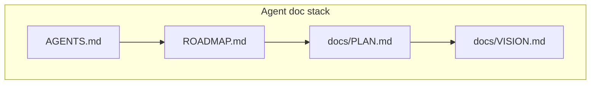
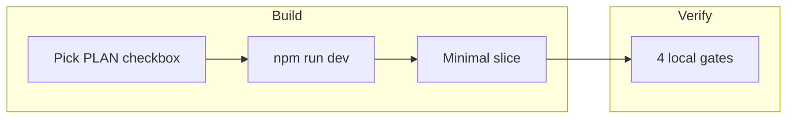

# aidea — gap closure plan (P7 + P8)

Structured backlog to close the gap between **vision** ([VISION.md](./VISION.md)) and **what ships today**. Read after [ROADMAP.md](../ROADMAP.md) **Current status**; pick **one slice** per loop iteration; mark checkboxes in this file and the matching [ROADMAP P7](../ROADMAP.md#p7--gap-closure-see-docsplanmd) or [ROADMAP P8](../ROADMAP.md#p8--harden--extend-see-docsplanmd) item when gates pass.

**P7** (complete) closed prod parity and the daily Home loop. **P8** hardens P7 spikes and extends live connectors + platform.

**Related:** [Roadmap](/docs/roadmap) · [Vision](/docs/vision) · [Agent instructions](/docs/agents) · [Deployment](/docs/deployment)

> **Interactive reader:** [/docs/plan](/docs/plan)

---

## Purpose & how to use

1. Check [ROADMAP.md](../ROADMAP.md) **Current status** for phase and prod/local delta.
2. **P7** is complete — start **P8.0** (P7 partials) unless blocked on external deps.
3. Pick the highest-priority unchecked item in the [P8 phasing](#p8--recommended-phasing) table (or ROADMAP P8 summary).
4. One logical slice per iteration — minimal diff, shared helpers in [AGENTS.md](../AGENTS.md).
5. When a slice ships: mark `[x]` here, matching ROADMAP item, and append **Loop log**; update VISION domain score if material.



---

## Build workflow

How to implement each P8 slice (same gates for any PLAN checkbox). Feature backlog stays in [Checkbox backlog](#checkbox-backlog) below.

### Per-slice loop

1. Read [ROADMAP.md](../ROADMAP.md) **Current status** and pick the highest-priority unchecked **P8** item (or remaining P7 if any).
2. Start a **single** dev server: `npm run dev` → `http://localhost:3000`
3. Implement a minimal diff — shared helpers in [AGENTS.md](../AGENTS.md) (SSE, queue, Work feed, save UX).
4. Run the [four test gates](#mandatory-gates-every-slice) before marking `[x]`.
5. **P7** is complete — do not reopen closed P7 checkboxes unless fixing a regression.



### Environment defaults

| Mode | `DATABASE_URL` | Storage | When |
|------|----------------|---------|------|
| **Fast iteration** | unset | `data/*.json` | Default daily dev |
| **Postgres parity** | set in `.env.local` | Postgres via [`lib/storage`](../lib/storage/index.ts) | Before prod deploy or DB-touching slices |

Copy keys from [`.env.local.example`](../.env.local.example). Full reference: [DEPLOYMENT.md](./DEPLOYMENT.md).

| Variable | Needed for |
|----------|------------|
| `AI_GATEWAY_API_KEY` or `ANTHROPIC_API_KEY` | Chat, agents, crons |
| `NANGO_SECRET_KEY` | Gmail & Calendar (paste manually — `vercel env pull` may return empty) |
| `BRAVE_SEARCH_API_KEY` | Web search tool |

### Dev hygiene

- Run **one** `next dev` process at a time.
- Do **not** run `npm run build` while dev is running — corrupts `.next` (500 / ENOENT manifest errors).
- Client code: import `@/lib/harness/queue-types`, not `@/lib/harness/queue` or `@/lib/storage`.

**Fix corrupted dev cache:**

```bash
lsof -ti:3000 | xargs kill -9 2>/dev/null; pkill -f "next dev" 2>/dev/null; sleep 1; rm -rf .next && npm run dev
```

### Slice → primary files

| Phase / area | Primary touchpoints |
|--------------|---------------------|
| P7.0 ship | git commit; Vercel redeploy — no new feature code |
| P7.1 morning ritual | `lib/harness/daily-kickstart.ts`, `lib/entities/daily.ts`, `HomeScreen.tsx`, `MorningBriefRenderer.tsx` |
| P7.1 Inbox hygiene | `lib/harness/proactive-tasks.ts`, `TaskFeed.tsx`, `/api/tasks`, profile or storage for dismiss/snooze |
| P7.1 audit viewer | `lib/harness/queue-audit.ts`, Settings or Inbox panel |
| P7.2 workforce → Inbox | `TaskFeed.tsx`, `queue-types.ts`, `execute-queued-action.ts`, cron monitor outputs |
| P7.2 human input | `lib/harness/tools.ts` (`request_human_input`), Home/Inbox UI |
| P7.3 connectors | New integration module + KB section + agent tool — one connector per slice |
| P7.4 timeline / autonomy | `HomeScreen.tsx`, `SettingsPanel.tsx`, `proactive-tasks.ts` |
| P8.0 P7 partials | `interaction-graph-persist.ts`, `domain-autonomy.ts`, `execute-queued-action.ts`, [DEPLOYMENT.md](./DEPLOYMENT.md) |
| P8.1 health connector | `lib/health/`, Settings integrations, Nango or provider OAuth |
| P8.2 contact graph | `interaction-graph.ts`, relationship-monitor cron, Gmail/Calendar signals |
| P8.3 finance spike | new `lib/finance/` or Plaid module, KB `finance` section |
| P8.4 platform | auth middleware, `DEFAULT_USER_ID`, mobile secondary views |

---

## Test strategy

### Mandatory gates (every slice)

Mark a PLAN checkbox `[x]` only when all pass:

```bash
npm run typecheck
npm test                    # lib/**/*.test.ts
npm run test:contract       # app/api/**/*.contract.test.ts
npm run build
```

GitHub Actions runs the same sequence on push/PR to `main` ([`.github/workflows/ci.yml`](../.github/workflows/ci.yml)).

### When to add or update tests

| Change touches | Action |
|----------------|--------|
| Pure logic in `lib/` | Add/update `lib/**/*.test.ts` |
| API route shape or status | Add/update `app/api/**/*.contract.test.ts` |
| UI-only (no testable logic) | Manual smoke on Home, Inbox, `/docs/plan` |
| Queue / tasks / feed behavior | Extend `lib/harness/tasks.test.ts` or `app/api/tasks/tasks.contract.test.ts` |

**Existing contract coverage:** `tasks`, `agents`, `integrations`, `reset` — extend when adding routes (e.g. dismiss/snooze API, audit viewer).

### Optional gates (not CI)

| Command | When | Requires |
|---------|------|----------|
| `npm run test:integration` | Pre-P7.0 deploy; after queue/chat changes | LLM key in `.env.local` |
| `npm run test:inbox-triage` | After inbox-triage / Gmail changes | LLM key |
| `INTEGRATION_GMAIL=1 npm run test:inbox-triage:live` | Before trusting prod Gmail | Nango + Gmail connected |
| `npm run build && npm start` | Prod-like UI speed check | Stop dev first |

### Phase-specific test focus

| Phase | Beyond four gates |
|-------|------------------|
| **P7.0** | Optional integration smoke; manual Home / Inbox / mobile / `/docs/plan` |
| **P7.1** | Unit tests for dismiss, snooze, audit logic; contract for new APIs |
| **P7.2** | Contract for non-email queue PATCH; manual calendar/KB approval cards |
| **P7.3** | Connector spike tests isolated; no live external API in unit/contract CI |
| **P7.4** | Autonomy and timeline logic unit tests |
| **P8.0** | Unit tests for `autonomyForAction` queue gating; contact persist wiring |
| **P8.1** | Connector spike tests isolated; no live wearable API in unit/contract CI |
| **P8.2** | Contact graph merge tests; manual cron smoke |
| **P8.3** | Finance spike tests isolated; no live Plaid in CI |
| **P8.4** | Auth contract tests when middleware lands; mobile manual smoke |

---

## Deployment workflow

### Policy

- **Default: local only** — no push or Vercel deploy unless explicitly requested in session.
- Never push with failing local gates or red CI.
- One logical commit per slice; message explains **why**.

See [AGENTS.md](../AGENTS.md) and [DEPLOYMENT.md](./DEPLOYMENT.md) for env vars and Postgres setup.

### P7.0 — Ship post-P6 (first deploy milestone)

**Pre-deploy checklist:**

1. All [four gates](#mandatory-gates-every-slice) pass locally.
2. Working tree committed (user request).
3. Vercel env verified for **aidea-co**:
   - `DATABASE_URL` (Postgres)
   - `AI_GATEWAY_API_KEY` (team key `aidea-co-prod`)
   - `NANGO_SECRET_KEY`
   - `CRON_SECRET` (crons in [`vercel.json`](../vercel.json))
4. Optional: `npm run test:integration` with valid LLM key.

**Deploy steps:**

1. Push to `main` (explicit user request).
2. Confirm GitHub Actions + Vercel build green.
3. Redeploy if env vars changed (env does not apply until redeployed).

**Post-deploy smoke** ([aidea-co.vercel.app](https://aidea-co.vercel.app)):

| Surface | Check |
|---------|-------|
| Home | Chat streams; fast path responds |
| Inbox | Tabs; email edit; approve / save / reject |
| Mobile | Inbox overlay; bottom nav |
| Settings | Integration status; activity reset |
| Docs | `/docs/plan` renders without console errors |
| Crons | `/api/monitor` reachable with `CRON_SECRET` |

Mark [P7.0](#p70--ship--stabilize) here and **P7.0 Ship post-P6** in [ROADMAP P7](../ROADMAP.md#p7--gap-closure-see-docsplanmd) when smoke passes.

### P7.1–P7.4 deploy cadence

- Not every checkbox needs a prod deploy.
- Recommended: deploy after each **phase** completes (or weekly if iterating locally).
- Before deploy: four gates + [phase-specific tests](#phase-specific-test-focus).
- Update [VISION.md](./VISION.md) deploy status and domain scores when prod catches up.

### Rollback and ops

- **Activity reset:** `POST /api/reset`, Settings → Danger zone, or `npm run reset:activity` — see [DEPLOYMENT.md § Activity reset](./DEPLOYMENT.md#activity-reset).
- **Corrupted local dev:** [Dev hygiene](#dev-hygiene) restart command above.

---

## Prerequisite: ship post-P6 (P7.0) — complete

P7.0 shipped post-P6 polish to [aidea-co.vercel.app](https://aidea-co.vercel.app) (`e9b6d55`, 2026-06-21). P7.1–P7.4 built on that prod baseline; **P8** continues from the same deploy cadence.

---

## Layer 1 — Data: unified picture of you

Semantic hub + connectors that agents read before acting.

### Exists today

| Area | How | Key files |
|------|-----|-----------|
| **Knowledge base** | Context editor, onboarding, `kb_read` / `update_kb` | `lib/harness/knowledge-base.ts`, Context UI |
| **Mail** | Nango Gmail — triage, drafts, send | `lib/nango/gmail.ts`, inbox-triage cron |
| **Calendar** | Nango Google Calendar — schedule, logistics | `lib/harness/tools.ts` (`calendar_*`) |
| **Web / news** | Brave search, news curator in Daily OS | `lib/harness/tools.ts`, daily agents |

### Missing or thin

| Gap | Today | Target |
|-----|-------|--------|
| **Live health sync** | Static KB `health` + agent inference | Apple Health, Strava, Whoop, etc. → KB or live read |
| **Rich contact graph** | KB `relationships` + `contacts_read` (Google People) + weekly relationship-monitor cron | Interaction history, last touch, channels per person |
| **Finance** | Phase 3 env placeholders only | Plaid, budgets, subscription alerts |
| **Async messaging** | Not started | Slack, WhatsApp, iMessage |
| **Docs / notes** | Not started | Notion, Drive |
| **Unified timeline** | No cross-domain “yesterday” view | Single chronological feed across mail, cal, health, projects |
| **Conflict resolution** | Calendar vs health KB can disagree silently | Explicit merge UX when sources conflict |

---

## Layer 2 — Agent workforce: background specialists that run

Dispatcher, crons, queue, and Studio harness.

### Exists today

| Area | How | Key files |
|------|-----|-----------|
| **Agent library** | Company, personal, daily, learning, creator, dispatch | `lib/agents/library/` |
| **Inbox triage** | Cron every 15m → queue dominates Home/Inbox | `lib/agents/library/daily/inbox-triage.ts` |
| **Daily OS** | 6-agent orchestrator + specialists | `lib/harness/daily-kickstart.ts`, `lib/entities/daily.ts` |
| **Crons** | Daily 6:30, inbox, relationships Mon 8am | `vercel.json` → `/api/monitor` |
| **Studio harness** | Spawn, wait, consensus, artifacts | `lib/harness/bootstrap.ts`, Studio UI |

### Missing or thin

| Gap | Today | Target | Key files |
|-----|-------|--------|-----------|
| **Daily lite brief on Home** | Full 6-agent run too heavy for daily ritual | Single-agent morning brief (ROADMAP P6 backlog) | `daily-kickstart.ts`, `lib/entities/daily.ts` |
| **Non-email cron outcomes** | health-briefer, relationship-monitor → entity state / Studio | Same prominence as inbox-triage in Inbox | `proactive-tasks.ts`, monitor crons |
| **True proactive outreach** | KB heuristics (stale job app, cooling contact) | Agent noticed X → queued action | `lib/harness/proactive-tasks.ts` |
| **Cross-domain orchestration** | Personal OS / Life CEO in Studio only | Feeds daily Home loop | `lib/entities/personal.ts`, Home launcher |
| **Action types beyond email** | `calendar_event`, `kb_update` in queue types; email-polished Inbox UX | Calendar holds, KB updates as first-class approval cards | `queue-types.ts`, `TaskFeed.tsx` |
| **Human-in-the-loop on Home** | `request_human_input` in harness | Productized on Home, not Studio-only | `lib/harness/tools.ts` |
| **Agent memory of outcomes** | Rejections not systematically fed back | “You rejected this draft style” → profile or override | `queue-audit.ts`, agent overrides |

---

## Layer 3 — Product UX: one surface for your day

Home chat + Inbox as the daily product.

### Exists today

| Area | How | Key files |
|------|-----|-----------|
| **Home chat** | Fast path + full dispatcher, streaming, persistence | `ChatInterface`, `fast-chat.ts`, `/api/message` |
| **Inbox** | Approvals vs suggestions tabs, live email edit, drafts | `TaskFeed.tsx`, `patchQueueAction` |
| **Mobile** | Bottom nav, full-height chat, Inbox overlay | `HomeScreen.tsx`, `MobileBottomNav` |
| **Work feed** | Shared poll, adaptive intervals | `useWorkFeed`, `/api/tasks` |
| **Reset** | Clear queue, chat, runs, brief | `POST /api/reset`, Settings |

### Missing or thin

| Gap | Today | Target | Key files |
|-----|-------|--------|-----------|
| **Morning ritual** | Chat-first; brief elsewhere | Open app → brief + top 3 approvals | `HomeScreen.tsx`, `MorningBriefRenderer.tsx` |
| **Inbox for non-email** | Email cards polished; other types generic | Calendar, KB, future finance as approval cards | `TaskFeed.tsx`, `action-labels.ts` |
| **Suggestion hygiene** | Discuss in chat only | Dismiss, snooze, “not relevant” | `proactive-tasks.ts`, `/api/tasks` |
| **Audit / history** | API only | “What did my workforce do this week?” UI | `queue-audit.ts`, storage |
| **Contact-centric views** | Not built | “Everything about Sarah” | new surface or Context tab |
| **Health-centric views** | Brief artifact / KB only | “This week’s training” on Home or Context | KB + future sync |
| **Trust & control** | Global `defaultAutonomyLevel` | Per-domain autonomy (email ok, finance never auto) | `proactive-tasks.ts`, Settings |
| **Prod parity** | Best UX local/uncommitted | Ship post-P6 to production | deploy |

---

## Recommended phasing

Ordered by leverage on the existing stack. Do not start a later phase until prerequisites pass gates.

| Phase | Focus | Rationale |
|-------|--------|-----------|
| **P7.0** | Ship & stabilize | Prod parity unlocks real daily use feedback |
| **P7.1** | UX on existing data | Morning ritual, brief surfacing, suggestion hygiene, audit viewer — no new connectors |
| **P7.2** | Workforce → Inbox | Cron outcomes, calendar/KB cards, `request_human_input` on Home |
| **P7.3** | Richer context | Pick **one** connector spike: contact graph **or** health sync — not both in first slice |
| **P7.4** | Unified timeline + governance | Cross-domain day view, conflict surfacing, per-domain autonomy dashboard |

---

## Checkbox backlog

Mark `[x]` only when `npm run typecheck`, `npm test`, `npm run test:contract`, and `npm run build` pass.

### P7.0 — Ship & stabilize

- [x] **Commit post-P6 polish** — Inbox, email edit, drafts, streaming, chat persist, reset, mobile, queue-types (`bd3a01b`)
- [x] **Deploy to aidea-co** — explicit user request; verify prod matches local Home/Inbox UX

### P7.1 — UX on existing data

- [x] **Daily lite brief** — Single-agent morning mode; skip 5 parallel sub-agents ([ROADMAP P6 backlog](../ROADMAP.md#p6-backlog-not-started))
- [x] **Morning brief on Home** — Cron/lite output → Inbox row or chat card, not Studio-only (`MorningBriefRenderer`, `HomeScreen`)
- [x] **Suggestion dismiss** — Persist dismissed proactive IDs; hide from feed (`proactive-tasks.ts`, profile or storage)
- [x] **Suggestion snooze** — Snooze until date; re-surface in feed
- [x] **Audit trail viewer** — Browse approved/rejected/saved queue history (`queue-audit.ts`, new Settings or Inbox panel)

### P7.2 — Workforce → Inbox

- [x] **Health-briefer → Inbox** — Workout/meal guidance as Inbox row or approval when actionable
- [x] **Relationship-monitor → Inbox** — Cooling contacts as queue or structured suggestion cards (not only KB nudge)
- [x] **Calendar approval cards** — Polished Inbox UX for `calendar_event` queue items (`TaskFeed`, `execute-queued-action.ts`)
- [x] **KB update approval cards** — Polished Inbox UX for `kb_update` queue items
- [x] **request_human_input on Home** — Surface harness human-input prompts in Inbox or chat modal (not Studio-only)

### P7.3 — Richer context (pick one per slice)

- [x] **Contact interaction graph (spike)** — Last touch, channels, interaction history beyond Google People read
- [x] **Health sync spike** — One wearable/API path → KB or live tool (Apple Health, Strava, or Whoop — pick one)

### P7.4 — Unified timeline + governance

- [x] **Unified timeline** — “What happened across domains yesterday” view on Home or dedicated tab
- [x] **Conflict surfacing** — When calendar vs health KB disagree, explicit merge UX for user
- [x] **Per-domain autonomy** — Trust dashboard: email semi-auto, finance never auto, etc. (`Settings`, `proactive-tasks.ts`)
- [x] **Contact-centric view** — “Everything about [person]” from KB + mail + calendar signals
- [x] **Health-centric view** — “This week’s training” from KB + sync when available

---

## P8 — Harden & extend

P7 delivered the daily loop on production: morning brief, Inbox hygiene, cron outcomes, timeline, and trust dashboard. P8 **finishes partial v1 work** (contact graph persist, per-domain autonomy on queue, documented prod smoke) and **extends live data** (one wearable, richer contacts, finance spike) before platform auth.

Use the same [Build workflow](#build-workflow), [Test strategy](#test-strategy), and [Deployment workflow](#deployment-workflow) — no duplicate gates.

### P8 — Recommended phasing

Ordered by leverage. Do not start a later phase until prerequisites pass gates.

| Phase | Focus | Rationale |
|-------|--------|-----------|
| **P8.0** | Complete P7 partials | Wire spikes agents already read; autonomy UI must affect queue |
| **P8.1** | Live health connector | One wearable OAuth + sync → KB `health.sync` |
| **P8.2** | Rich contact graph | Last touch from Gmail/Calendar; relationship-monitor writes graph |
| **P8.3** | Finance spike | Minimal Plaid read-only or subscription alerts |
| **P8.4** | Platform | Auth/multi-user; mobile polish on secondary surfaces |

### P8 — Checkbox backlog

Mark `[x]` only when [mandatory gates](#mandatory-gates-every-slice) pass.

#### P8.0 — Complete P7 partials

- [x] **Contact interaction recording** — Wire `recordContactInteraction` from harness tools and approve/send paths (`lib/contacts/interaction-graph-persist.ts`, `tools.ts`)
- [x] **Per-domain queue apply** — `autonomyForAction` gates auto-run vs needs-you on queue PATCH/execute (`domain-autonomy.ts`, `execute-queued-action.ts`)
- [x] **Prod smoke checklist** — Document post-deploy verification in [DEPLOYMENT.md](./DEPLOYMENT.md) (extends P7.0 smoke table)

#### P8.1 — Live health connector

- [ ] **Wearable OAuth** — One provider: Strava **or** Apple Health **or** Whoop — connect/disconnect in Settings
- [ ] **Health sync job** — Pull recent activities → KB `health.sync`; `health_read` tool reflects live data (`lib/health/`)

#### P8.2 — Rich contact graph

- [ ] **Last touch from mail/calendar** — Derive interaction signals from Gmail/Calendar into graph (`interaction-graph.ts`, Nango)
- [ ] **Relationship-monitor → graph** — Cron writes cooling-contact and outreach outcomes via `recordContactInteraction`

#### P8.3 — Finance spike

- [ ] **Finance connector (minimal)** — Plaid read-only balances/transactions **or** subscription alert heuristics from KB/mail — pick one per slice
- [ ] **Finance in Inbox** — Actionable finance nudges as suggestion or approval cards when spike warrants queue

#### P8.4 — Platform

- [ ] **Auth / multi-user** — Replace single `DEFAULT_USER_ID`; session middleware; per-user profile/KB ([VISION D11](./VISION.md#d11-production-platform--62))
- [ ] **Mobile secondary surfaces** — Agents, Context, Settings usable on small screens (Home loop already mobile-first)

### Deferred (post-P8)

- Full 6-agent Daily OS as default Home morning path (lite brief remains default)
- All Phase 3 connectors at once (Slack, Notion, WhatsApp, Twilio)
- Autonomous send without approval in supervised mode
- Billing and team SaaS packaging

---

## Explicit non-goals for P7

Align with [VISION.md — Explicitly deferred](./VISION.md#explicitly-deferred):

- Not a public multi-user SaaS in P7
- Not replacing Gmail/Calendar/health apps as primary UI
- Not building every connector before Home morning ritual works on prod
- Not merging Studio debug UX into Home daily loop

---

## Explicit non-goals for P8

Align with [VISION.md — Explicitly deferred](./VISION.md#explicitly-deferred):

- Not building every Phase 3 connector in one release
- Not autonomous finance actions without approval
- Not replacing native health/finance apps as primary UI
- Not full Daily OS orchestrator as default morning path

---

## Updating this document

When a checkbox closes:

1. Mark `[x]` here and the matching [ROADMAP P7](../ROADMAP.md#p7--gap-closure-see-docsplanmd) or [ROADMAP P8](../ROADMAP.md#p8--harden--extend-see-docsplanmd) item.
2. Update [VISION.md](./VISION.md) domain score and **Next enrichment** if the domain changed materially.
3. Append one line to [ROADMAP Loop log](../ROADMAP.md#loop-log).
