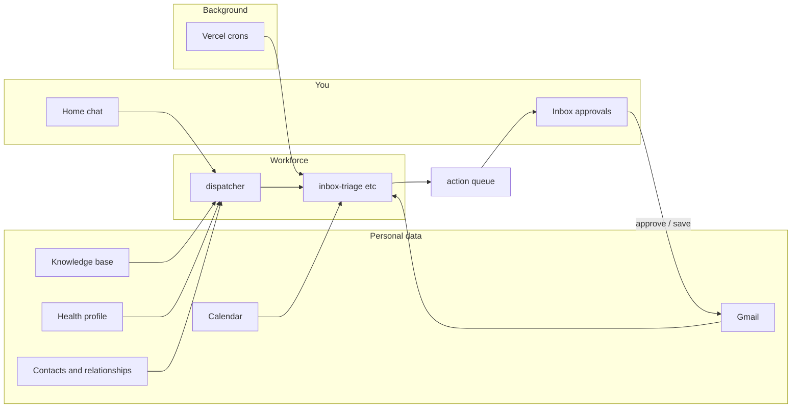
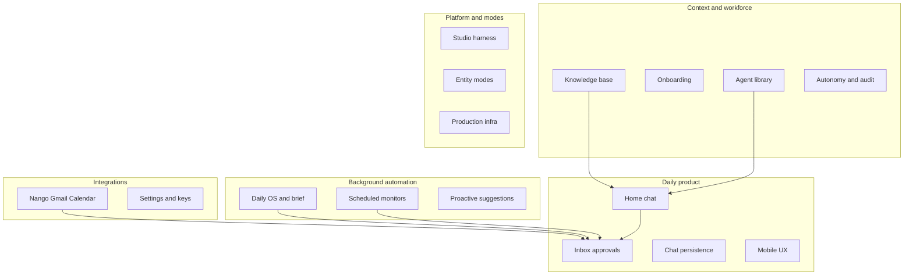

# aidea — product vision

Personal AI chief-of-staff. **Home + Inbox is the daily product**; Studio and entity modes are the harness for deeper runs.

**Related:** [Roadmap](/docs/roadmap) · [Gap closure plan](/docs/plan) · [Agent instructions](/docs/agents) · [Deployment](/docs/deployment)

> **Interactive reader:** Open [/docs/vision](/docs/vision) in the app to view Mermaid diagrams and use light reading mode (sidebar nav + table of contents).

---

## Vision statement

**One-liner:** aidea is a personal AI chief-of-staff that runs a background workforce across **your life context** — mail, calendar, health, contacts, projects, and whatever else you connect — you delegate in chat and approve real-world actions in Inbox.

**Expanded:**

You talk to one Home surface; a dispatcher routes work to specialist agents grounded in a **unified picture of you**: knowledge base (identity, goals, family, health, relationships, work), connected services (Gmail, Calendar today; more sources over time), and scheduled monitors that keep that picture fresh. Agents queue emails, profile updates, and nudges; outward actions go through **Inbox → Awaiting approval** (edit, then send, save to drafts, or reject). The product is not “an email client with AI” — email and calendar are the first high-signal connectors, not the ceiling.

**Non-goals (today):**

- Not a public multi-user SaaS (no auth; single `DEFAULT_USER_ID`)
- Not a replacement for Gmail, Calendar, or health/fitness apps as the primary UI
- Not autonomous send-without-approval for supervised actions
- Not every connector in [`.env.local.example`](../.env.local.example) Phase 3 (Plaid, Slack, Notion, WhatsApp, etc.) — vision includes them; implementation follows by domain

---

## Personal data sources

Vision: one chief-of-staff reasons over **all** relevant personal data. Implementation rolls out by domain; the KB is always the semantic layer agents read first.

| Domain | In vision | In product today | How |
|--------|-----------|------------------|-----|
| **Knowledge base** | Core | Live | Context editor, onboarding, `kb_read` / `update_kb` |
| **Mail** | Core | Live | Nango Gmail — triage, drafts, send |
| **Calendar** | Core | Live | Nango Google Calendar — schedule, logistics |
| **Contacts & social graph** | Core | Partial | KB `relationships`; Google People; interaction graph spike; relationship-monitor → Inbox |
| **Health & fitness** | Core | Partial | KB `health`; health-briefer → Inbox; sync spike (`lib/health/sync`); no live wearable OAuth yet |
| **Work & projects** | Core | Live | KB projects/job apps; proactive Inbox suggestions |
| **News & web** | Supporting | Live | Brave search, news curator in Daily OS |
| **Finance** | Future | Stub | Phase 3 Plaid placeholders only |
| **Messaging (Slack, WhatsApp)** | Future | Stub | Phase 3 env placeholders only |
| **Notes / docs (Notion, etc.)** | Future | Stub | Phase 3 env placeholders only |

**Principle:** new sources attach through **integrations + KB sections + specialist agents**, then surface outcomes in **chat** and **Inbox** — same approval loop, richer context.

---

## Who it is for

| Audience | Today | Future |
|----------|-------|--------|
| **Primary** | One power user on a personal deploy ([aidea-co.vercel.app](https://aidea-co.vercel.app)) | Same, with higher reliability |
| **Secondary** | Builder/debugger using Studio and Agent Library | — |
| **Not yet** | Teams, signup, billing | Multi-user when auth lands on [ROADMAP.md](../ROADMAP.md) |

---

## Core loop

**Interactive path:** message → dispatcher (or fast chat) → tools + queue → Inbox → edit → send/draft.

**Background path:** cron → inbox-triage / daily-orchestrator / relationship-monitor → queue or brief storage → surfaces in Inbox or Studio.

---

## Functional domains

Twelve domains map vision to code. Update enrichment scores when a domain materially changes.

| ID | Domain | User-facing purpose | Primary surfaces | Core modules |
|----|--------|---------------------|------------------|--------------|
| **D1** | Home chat | Delegate in natural language | `ChatInterface.tsx`, `HomeScreen.tsx` | `fast-chat.ts`, `dispatcher.ts`, `POST /api/message` |
| **D2** | Inbox | Approve, edit, send/draft/reject | `TaskFeed.tsx` | `tasks.ts`, `queue.ts`, `execute-queued-action.ts`, `PATCH /api/queue` |
| **D3** | Daily OS | Morning brief + day context | Studio artifacts; cron today | `daily-kickstart.ts`, `POST /api/monitor`, `MorningBriefRenderer.tsx`, `GET /api/brief` |
| **D4** | Integrations | Connect Gmail/Calendar | `SettingsPanel.tsx`, `IntegrationStatusBar.tsx` | `lib/nango/*`, `GET /api/integrations` |
| **D5** | KB & onboarding | Who you are; agent context | Context, onboarding wizards | `knowledge-base.ts`, `KnowledgeBaseEditor.tsx`, `POST /api/kb` |
| **D6** | Agent library | View/customize workforce | `AgentLibrary.tsx` | `lib/agents/library/`, `resolve.ts`, `GET /api/agents` |
| **D7** | Studio | Debug and deep entity runs | `RunStudio.tsx` | `useHarnessSession.ts`, `bootstrap.ts`, `POST /api/run` |
| **D8** | Entity modes | Company / Learning / Creator / Personal / Daily | Home launcher + Studio | `lib/entities/*.ts`, `EntityRunLauncher.tsx` |
| **D9** | Proactive & governance | Nudges, autonomy, audit | Inbox Suggestions tab; autonomy chip | `proactive-tasks.ts`, `queue-audit.ts`, `GET /api/queue/audit` |
| **D10** | Chat persistence | Threads across sessions | Sidebar, `ConversationDrawer.tsx` | `useChatConversations.tsx`, `GET/PUT/DELETE /api/chat` |
| **D11** | Production platform | Deploy, storage, reset, crons | Settings Danger zone | `lib/storage/`, `POST /api/reset`, `vercel.json` |
| **D12** | Mobile | Phone-first Home + Inbox | `MobileBottomNav.tsx`, Inbox overlay | Same APIs as desktop |

### Entity modes (D8 detail)

| Mode | Home launcher | Cron | Notes |
|------|---------------|------|-------|
| Company | Yes | — | Studio CEO runs |
| Learning | Yes | — | Curriculum / practice agents |
| Creator | Yes | — | Content / distribution agents |
| Personal | Studio only | Mon 8am relationships | Life CEO + directors |
| Daily | Studio + cron | 6:30 daily brief | Five parallel sub-agents; lite mode backlog |

### Scheduled monitors (D3 / D11)

| Cron (`vercel.json`) | Monitor | Agent |
|----------------------|---------|-------|
| `30 6 * * *` | `name=daily` | daily-orchestrator → morning brief |
| `*/15 7-22 * * *` | `name=inbox` | inbox-triage → queue |
| `0 8 * * 1` | `name=relationships` | relationship-monitor |

---

## Enrichment rubric

| Level | Score | Meaning |
|-------|------:|---------|
| **Production-ready** | 80–100 | Reliable daily use; tested; surfaced on Home |
| **Functional** | 60–79 | Works end-to-end but thin UX, ops friction, or wrong surface |
| **Partial** | 40–59 | Backend or Studio-only; missing Home integration |
| **Stub** | 20–39 | Config/prompts exist; not a felt product loop |
| **Missing** | 0–19 | Not implemented |

**Last scored:** 2026-06-21 · **Overall:** ~85/100

**Prod vs local:** P7 gap closure shipped to [aidea-co.vercel.app](https://aidea-co.vercel.app) (2026-06-21). Home/Inbox daily loop, morning brief, audit viewer, timeline, and trust dashboard are on prod. **P8 partials** (contact graph persist, per-domain queue apply) remain code spikes not yet fully wired.

---

## Enrichment scorecard

| Domain | Score | Level | Top gaps |
|--------|------:|-------|----------|
| D1 Home chat | 85 | Production-ready | Full tool path slow; no `/api/message` contract test |
| D2 Inbox | 93 | Production-ready | Per-domain queue apply not wired (P8.0) |
| D3 Daily OS | 78 | Functional | Full six-agent run still slow; lite brief is default on Home |
| D4 Integrations | 78 | Functional | Manual Nango `gmail.compose`; env ops fragile |
| D5 KB & onboarding | 85 | Production-ready | Contact/health lenses; no import/export UI |
| D6 Agent library | 85 | Production-ready | No override history/diff |
| D7 Studio | 83 | Functional (dev) | Debug-first, not end-user product |
| D8 Entity modes | 80 | Functional | Personal/Daily absent from Home launcher |
| D9 Proactive & governance | 85 | Production-ready | Per-domain autonomy UI; queue gating partial (P8.0) |
| D10 Chat persistence | 85 | Production-ready | Dual localStorage sync; no chat contract tests |
| D11 Production platform | 72 | Functional | No auth; single `DEFAULT_USER_ID`; prod smoke doc pending (P8.0) |
| D12 Mobile | 82 | Functional | Secondary views (Agents, Context, Settings) desktop-first |

**Strength:** chat → Inbox → Gmail approval loop; morning brief and cron outcomes on Home.

**Weakness:** Live connector OAuth (health, finance), contact graph persist, multi-user auth.

---

## Domain deep-dives

### D1 Home chat — 85

**Works:** Fast path (Haiku, no tools) for greetings and general Q&A; full dispatcher for inbox/calendar/drafts; SSE streaming and markdown; inbox summary cards; conversation history to dispatcher.

**Partial:** Multi-second latency on tool-heavy messages.

**Next enrichment:** Daily lite routing; `/api/message` contract test.

### D2 Inbox — 93

**Works:** Unified feed; tabs All / Awaiting approval / Suggestions / Running / Done; live email edit; calendar/KB approval cards; dismiss/snooze suggestions; audit trail in Settings; cron outcomes (health-briefer, relationship-monitor); `request_human_input` on Home.

**Partial:** Per-domain autonomy UI exists; queue auto-run gating not fully wired ([PLAN P8.0](./PLAN.md#p80--complete-p7-partials)).

**Next enrichment:** Wire `autonomyForAction` on queue PATCH/execute.

### D3 Daily OS — 78

**Works:** Lite brief on Home (default); cron at 6:30; brief → Inbox row or chat card; `MorningBriefRenderer`; full six-agent path in Studio/cron.

**Partial:** Full six-agent run is slow/expensive; not default morning path.

**Next enrichment:** Live health sync ([PLAN P8.1](./PLAN.md#p81--live-health-connector)); keep lite as default.

### D4 Integrations — 78

**Works:** Nango OAuth for Gmail and Calendar; connect/disconnect in Settings; gmail read/send/draft, calendar read/create, contacts read in harness; integration status bar on Home.

**Partial:** Health and social data mostly via KB + agents, not live wearable or messaging APIs; `gmail.compose` scope manual in Nango; env ops fragile.

**Next enrichment:** Document connector roadmap by domain; first new OAuth beyond Google when prioritized (Notion, Slack, health APIs).

### D5 KB & onboarding — 85

**Works:** Full KB editor (Context); contact-centric and health-centric lenses (P7.4); 3-step quick start + 18-step wizard; `writeManyKB` / `mergeProfile`.

**Partial:** No user-facing import/export (dev JSON only); contact graph persist not wired (P8.0).

**Next enrichment:** Wire interaction recording; profile import/export from Context.

### D6 Agent library — 85

**Works:** Full library (company, personal, daily, learning, creator, dispatch); prompt/tool overrides; runtime via `resolveLibraryAgent`.

**Partial:** No override history or diff view.

**Next enrichment:** Version or reset history per agent.

### D7 Studio — 83

**Works:** SSE entity runs; agent graph, tool feed, state explorer, consensus, artifacts, human-in-the-loop overlay.

**Partial:** Debug-first UX; session reset is in-memory only.

**Next enrichment:** Keep as builder surface; do not merge into Home daily loop.

### D8 Entity modes — 80

**Works:** Real agent trees for all five modes (P3); Home launcher for company/learning/creator; Studio for all.

**Partial:** Personal and Daily not on Home launcher; Daily is heavy.

**Next enrichment:** Optional “Run daily brief” on Home; lite mode.

### D9 Proactive & governance — 85

**Works:** Proactive suggestions; dismiss/snooze; per-domain autonomy dashboard (Settings); audit log + Settings viewer; Yesterday timeline tab.

**Partial:** Suggestions remain KB-heuristic; per-domain autonomy does not yet gate queue auto-run (P8.0).

**Next enrichment:** `autonomyForAction` on queue execute; richer contact graph (P8.2).

### D10 Chat persistence — 85

**Works:** Server-side conversations (Postgres or `data/chat/`); hard delete; sidebar + mobile drawer; sync to server; cleared on activity reset; on prod since P7.0.

**Partial:** `localStorage` (`aidea-chat-v1`) + server dual sync; no contract tests.

**Next enrichment:** Chat API contract tests; simplify sync edge cases.

### D11 Production platform — 72

**Works:** Postgres schema and migrate; Vercel deploy; crons with `CRON_SECRET`; activity reset; AI Gateway path; P7 shipped to prod.

**Partial:** No auth middleware; single tenant; post-deploy smoke checklist pending ([PLAN P8.0](./PLAN.md#p80--complete-p7-partials)).

**Next enrichment:** Document prod smoke in [DEPLOYMENT.md](./DEPLOYMENT.md); auth + per-user `DEFAULT_USER_ID` ([PLAN P8.4](./PLAN.md#p84--platform)).

### D12 Mobile — 82

**Works:** Bottom nav; full-height chat; Inbox full-screen overlay; Yesterday tab; conversation drawer; safe-area padding; Home loop on prod.

**Partial:** Agents, Studio, Context usable but not mobile-optimized ([PLAN P8.4](./PLAN.md#p84--platform)).

**Next enrichment:** Mobile polish on secondary views.

---

## Strategic priorities

**P7 closed prod parity and the daily loop** (morning brief on Home, Inbox hygiene, cron outcomes, timeline, trust dashboard). Post-gap work is **[P8 — Harden & extend](./PLAN.md#p8--harden--extend)** — see [ROADMAP P8](../ROADMAP.md#p8--harden--extend-see-docsplanmd) for summary checkboxes.

Ordered by vision impact vs current gaps. Detailed slices: [docs/PLAN.md § P8](./PLAN.md#p8--checkbox-backlog).

1. **Complete P7 partials** — [PLAN P8.0](./PLAN.md#p80--complete-p7-partials); contact graph persist, per-domain queue apply, prod smoke doc.
2. **Live health connector** — [PLAN P8.1](./PLAN.md#p81--live-health-connector); one wearable OAuth + sync.
3. **Rich contact graph** — [PLAN P8.2](./PLAN.md#p82--rich-contact-graph); mail/calendar last touch; relationship-monitor writes.
4. **Finance spike** — [PLAN P8.3](./PLAN.md#p83--finance-spike); minimal Plaid or subscription alerts.
5. **Platform** — [PLAN P8.4](./PLAN.md#p84--platform); auth/multi-user; mobile secondary surfaces.
6. **Deferred post-P8** — [PLAN deferred](./PLAN.md#deferred-post-p8); full 6-agent Daily OS default, all Phase 3 connectors, autonomous send.

---

## Explicitly deferred

Connectors listed in [`.env.local.example`](../.env.local.example) Phase 3 — **in vision, scheduled in [PLAN P8](./PLAN.md#p8--harden--extend) or deferred post-P8**:

- Finance (Plaid) — [PLAN P8.3](./PLAN.md#p83--finance-spike)
- Wearables / Apple Health / Strava-style health sync — [PLAN P8.1](./PLAN.md#p81--live-health-connector)
- Multi-user auth — [PLAN P8.4](./PLAN.md#p84--platform)
- Slack, Notion, Twilio/WhatsApp — post-P8
- Autonomous send without approval (supervised mode) — post-P8
- Daily full orchestrator as default morning path (prefer lite on Home) — post-P8
- Billing and team SaaS — post-P8

Mail and calendar are **live**, not deferred — they are the first connectors, not the full scope.

---

## Updating this document

When a domain changes materially:

1. Adjust score (±5 typical per slice).
2. Update **Top gaps** and **Next enrichment** for that domain.
3. Bump **Last scored** date.
4. Note deploy status if prod caught up to local.
5. Check off the matching item in [docs/PLAN.md](./PLAN.md) and [ROADMAP P7](../ROADMAP.md#p7--gap-closure-see-docsplanmd) or [ROADMAP P8](../ROADMAP.md#p8--harden--extend-see-docsplanmd) when a strategic priority closes.

Loop agents may append one line to [ROADMAP.md](../ROADMAP.md) **Loop log** when a priority item closes a gap listed here.
